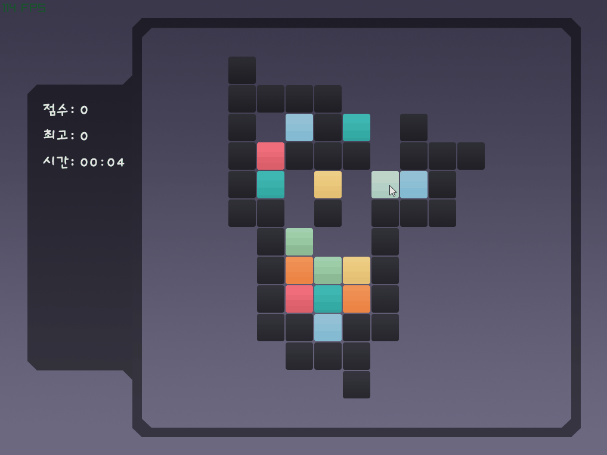

# leko-demo

A block puzzle game inspired by the game 'blox forever', made with [raylib](https://github.com/raysan5/raylib).

## Rules
- Match same-colored blocks by dragging them with your mouse.
- Remove all colored blocks to finish the current level.

## Gameplay

## License
MIT License